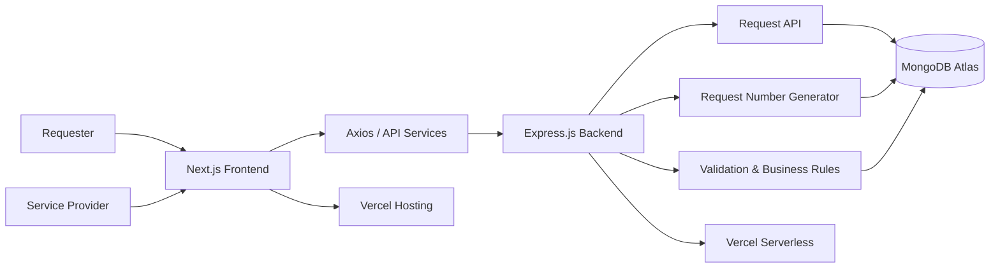
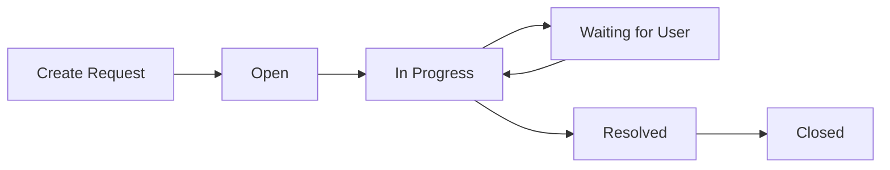

# Service Request Desk (SRD)

A modern **Service Request Management System** built to streamline how
service requests are created, tracked, assigned, filtered, updated, and
resolved.

The application provides separate experiences for **Requesters** and
**Service Providers**, with a clean dashboard-driven interface for
managing the complete request lifecycle.

### Live Application

**[Open Service Request
Desk](https://service-request-desk-1o9r.vercel.app)**

------------------------------------------------------------------------

## Overview

Service Request Desk (SRD) is a full-stack web application designed
around a simple workflow:

**Requester creates a request → Provider reviews it → Request is
assigned and updated → Internal notes are added when needed → Request
moves through its lifecycle until resolution/closure.**

The project focuses on making request management clear and practical
rather than overwhelming users with unnecessary complexity.

------------------------------------------------------------------------

## Key Features

### Requester

-   Create a new service request
-   Provide request title and detailed description
-   Select request category
-   Set request priority
-   Receive a unique request number
-   View submitted request details
-   Track request status and updates

### Service Provider

-   Provider dashboard with request overview
-   View all service requests
-   Search and filter requests
-   Filter by:
    -   Status
    -   Priority
    -   Category
    -   Assigned person
-   Pagination for request lists
-   Open detailed request information
-   Assign requests to support team members
-   Update request status
-   Update request priority
-   Add internal notes
-   Follow controlled request-status transitions
-   Prevent updates to closed requests

### Request Number

Every newly created request receives a human-friendly identifier such
as:

`REQ-2026-0001`

This makes it easier to communicate about a request without relying only
on a database ObjectId.

------------------------------------------------------------------------

## Application Screenshots

### Home Page


### Create Request


### Request Submitted


### Provider Dashboard


### All Requests


### Active Filtering


### Provider Request Details


### Update Request Modal


### Requester Request Details


------------------------------------------------------------------------

## System Architecture



### Request Lifecycle



The application keeps the request lifecycle controlled so that a request
cannot simply be closed before reaching the resolved state.

------------------------------------------------------------------------

## Tech Stack

### Frontend

-   **Next.js**
-   **React**
-   **Tailwind CSS**
-   **Axios**
-   **React Icons**
-   **React Spinners**

### Backend

-   **Node.js**
-   **Express.js**
-   **MongoDB**
-   **MongoDB Node.js Driver**
-   **CORS**
-   **dotenv**

### Deployment

-   **Vercel** --- Frontend
-   **Vercel** --- Backend
-   **MongoDB Atlas** --- Database

------------------------------------------------------------------------

## Project Structure

The project is organized as a single repository containing separate
frontend and backend applications.

``` text
service-request-desk/
│
├── frontend/
│   ├── public/
│   ├── src/
│   │   └── app/
│   │       ├── components/
│   │       ├── create-request/
│   │       ├── provider/
│   │       ├── request/
│   │       ├── request-submitted/
│   │       ├── favicon.ico
│   │       ├── globals.css
│   │       ├── layout.js
│   │       ├── loading.jsx
│   │       ├── not-found.jsx
│   │       └── page.js
│   │
│   ├── lib/
│   ├── pages/
│   ├── providers/
│   ├── services/
│   ├── .env.local
│   ├── next.config.mjs
│   ├── package.json
│   └── README.md
│
└── backend/
    ├── api/
    ├── src/
    │   └── config/
    │       └── db.js
    ├── .env
    ├── .env.local
    ├── app.js
    ├── index.js
    ├── server.js
    ├── vercel.json
    ├── package.json
    └── package-lock.json
```

> The structure above reflects the current project organization shown in
> the development workspace.

------------------------------------------------------------------------

## API Endpoints

### Requests

  ---------------------------------------------------------------------------
  Method                  Endpoint                    Purpose
  ----------------------- --------------------------- -----------------------
  `POST`                  `/api/requests`             Create a new request

  `GET`                   `/api/requests`             Get requests with
                                                      pagination, search and
                                                      filters

  `GET`                   `/api/requests/:id`         Get a single request

  `PATCH`                 `/api/requests/:id`         Update request status,
                                                      priority or assignee

  `POST`                  `/api/requests/:id/notes`   Add an internal note
  ---------------------------------------------------------------------------

### Request List Query Parameters

The request list API supports:

-   `page`
-   `limit`
-   `search`
-   `status`
-   `priority`
-   `category`
-   `assignedPerson`

Example:

`/api/requests?page=1&limit=10`

------------------------------------------------------------------------

## Data Model

A request contains information similar to:

``` text
Request
├── _id
├── requestNumber
├── title
├── description
├── requesterName
├── category
├── priority
├── status
├── assignedPerson
├── internalNotes[]
├── createdAt
└── updatedAt
```

### Request Categories

-   Hardware
-   Software
-   Access
-   Network
-   Other

### Priorities

-   Low
-   Medium
-   High
-   Urgent

### Statuses

-   Open
-   In Progress
-   Waiting for User
-   Resolved
-   Closed

------------------------------------------------------------------------

## Validation & Business Rules

The backend performs server-side validation before modifying the
database.

Examples include:

-   Required fields are checked when creating a request.
-   Request titles have length restrictions.
-   Descriptions have length restrictions.
-   Requester names are validated.
-   Category values are restricted to supported categories.
-   Priority values are validated.
-   Status values are validated.
-   Only valid support people can be assigned.
-   Closed requests cannot be modified.
-   A request must be resolved before it can be closed.
-   Empty internal notes are rejected.

This keeps the API responsible for enforcing important business rules
instead of relying only on frontend validation.

------------------------------------------------------------------------

## Getting Started

### 1. Clone the repository

``` bash
git clone <your-github-repository-url>
cd service-request-desk
```

### 2. Install frontend dependencies

``` bash
cd frontend
npm install
```

### 3. Install backend dependencies

Open another terminal:

``` bash
cd backend
npm install
```

------------------------------------------------------------------------

## Environment Variables

### Frontend

Create:

``` text
frontend/.env.local
```

Add:

``` env
NEXT_PUBLIC_API_URL=http://localhost:5000
```

For production, use your deployed backend URL:

``` env
NEXT_PUBLIC_API_URL=https://your-backend.vercel.app
```

### Backend

Create:

``` text
backend/.env
```

Add your MongoDB connection string:

``` env
MONGODB_URI=your_mongodb_connection_string
```

For production, add the same variable through the Vercel project's
Environment Variables settings.

> Never commit `.env` or `.env.local` files containing secrets.

------------------------------------------------------------------------

## Run Locally

### Start Backend

``` bash
cd backend
npm start
```

The backend runs locally on the configured port, typically:

``` text
http://localhost:5000
```

### Start Frontend

In another terminal:

``` bash
cd frontend
npm run dev
```

Then open:

``` text
http://localhost:3000
```

------------------------------------------------------------------------

## Deployment

The application is deployed as two Vercel projects from the same GitHub
repository.

``` text
GitHub Repository
│
├── frontend/ ──────► Vercel Frontend
│
└── backend/ ───────► Vercel Backend
                           │
                           ▼
                      MongoDB Atlas
```

### Frontend Deployment

Set the Vercel Root Directory to:

``` text
frontend
```

Add:

``` env
NEXT_PUBLIC_API_URL=https://your-backend.vercel.app
```

### Backend Deployment

Set the Vercel Root Directory to:

``` text
backend
```

Add:

``` env
MONGODB_URI=your_mongodb_connection_string
FRONTEND_URL=https://your-frontend.vercel.app
```

After changing environment variables, redeploy the corresponding Vercel
project.

------------------------------------------------------------------------

## Why This Project?

Service Request Desk was built around a common support-team workflow:
users need a simple way to submit issues, while service providers need a
structured way to organize and resolve them.

The project demonstrates practical full-stack concepts including:

-   REST API design
-   CRUD-style request management
-   MongoDB data persistence
-   Server-side validation
-   Search and filtering
-   Pagination
-   Request lifecycle management
-   Assignment workflows
-   Internal notes
-   Environment-based configuration
-   Frontend/backend separation
-   Production deployment with Vercel

------------------------------------------------------------------------

## Future Improvements

Possible future improvements include:

-   Authentication and role-based access control
-   Email notifications
-   Real-time request updates
-   File and image attachments
-   Advanced analytics and reporting
-   Provider activity history
-   Audit logs
-   SLA tracking
-   Automated request categorization
-   Improved notification system

------------------------------------------------------------------------

## Live Demo

**[Service Request Desk --- Live
Application](https://service-request-desk-1o9r.vercel.app)**


